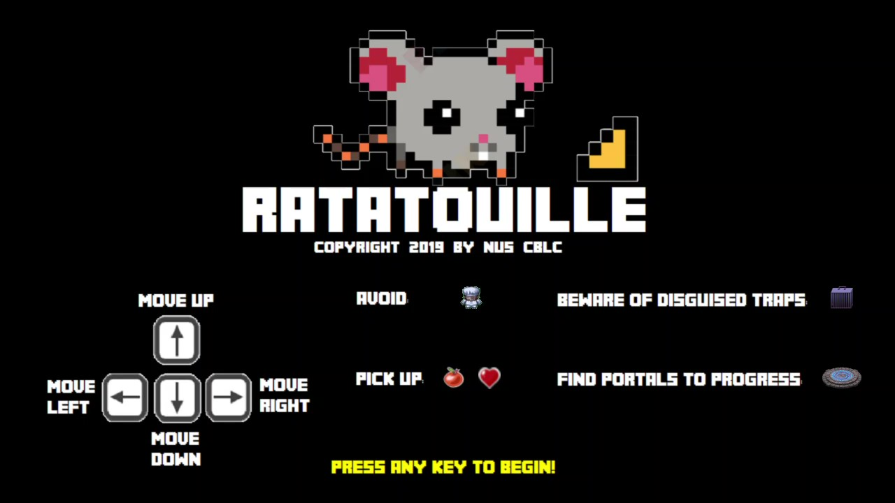
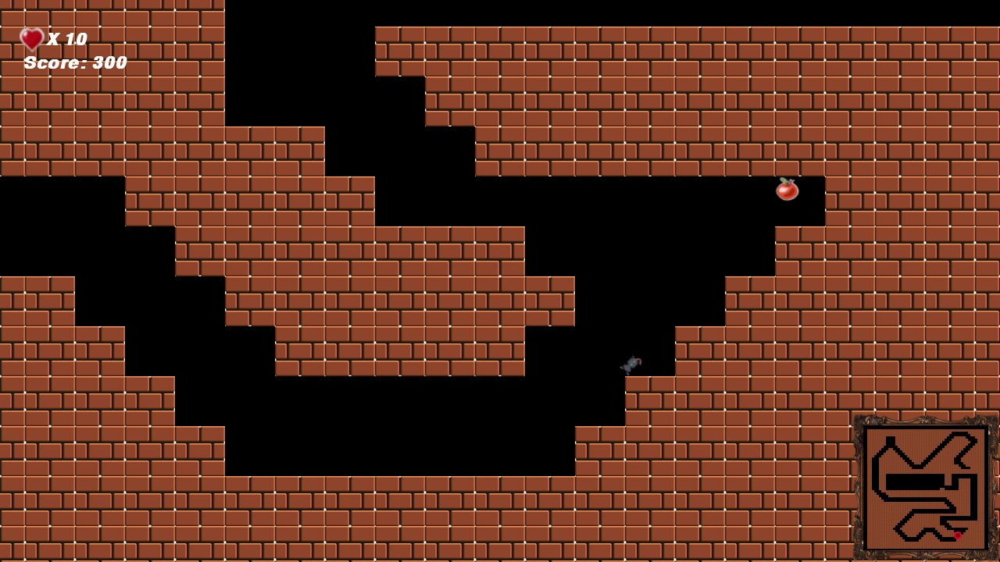
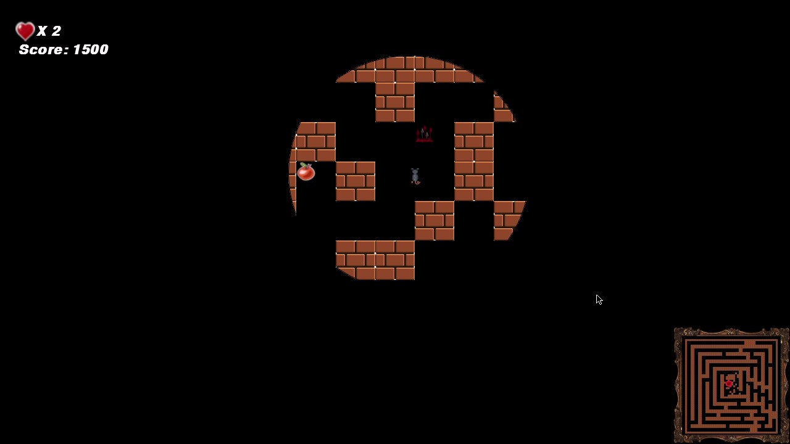
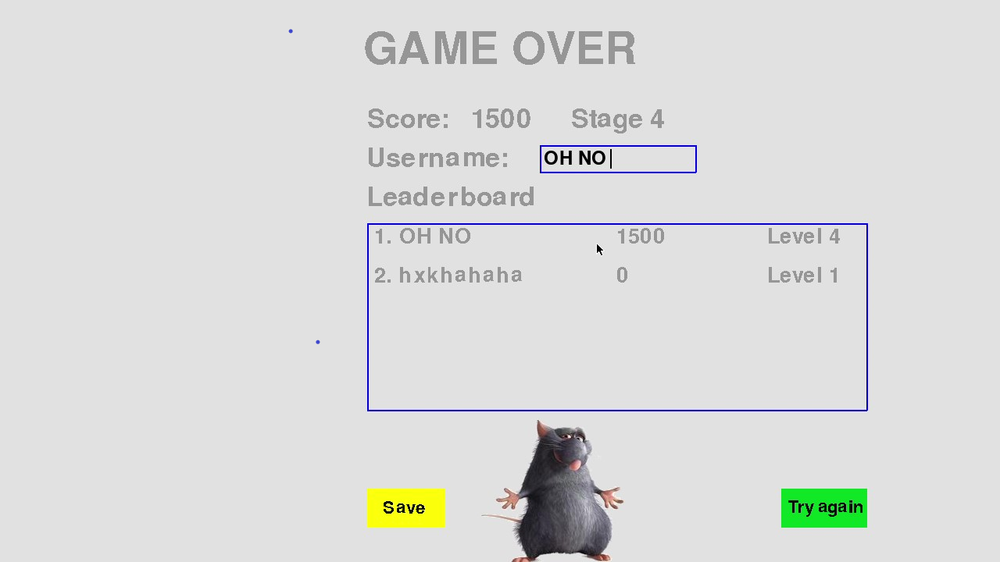

# Maze Master

Maze Master is a maze game template built with pygame. It allows user to create their maze design without any coding knowledge.

**[Click here to watch the gameplay ](https://www.youtube.com/watch?v=OkyE1ssDXnQ).**

## Installation

1. Install python 3.6 and above
2. Use the package manager [pip](https://pip.pypa.io/en/stable/) to install [pygame](https://www.pygame.org/news).

```bash
pip install game
```

## Usage

1. Run `python maze.py` to start the game.
2. Edit the file `design.py` to customize your maze. Refer to the [Design Guide](#Design-Guide) for further details.

## Design Guide

Edit the file `design.py` to customize your maze

```
# Edit the char in the array to build your maze in each level.
level_1 = [
    "XXXXXXXXXXXXXXXXXXXXXXXXXXXXXXXXXXXXXXXXXXXXXXXXXX",
    "XP     I     E       I          XXXXXX           X",
    "X  XX  XX  XX          S      CS         XX   EI X",
    "X  XXIIXX  XX  XXXXXXXXXXXXXXXXXXXX  XX  XXIIXX  X",
    "X  XX  XX  XX  XXXXXXXXXXXXXXXXXXXX  XX  XX  XX  X",
    "XIIXX  XX  XX  XX            XX  XX  XXS XXT XX  X",
    "X  XX  XX  XX  XXII E      X XX  XX  XX  XXE XX  X",
    "X  XX  XXXXXX  XXS XX  XXXX XXX  XX  XX  XX  XX  X",
    "X  XX  XXXXXX  XX  XX XXXXX XXX  XX  XX  XX  XX  X",
    "X  XXE XX   I  XX  XX XXXXX  XX  XXXXXX  XX  XXS X",
    "X  XX  XX   I  XX  XX  X  X  XXIIXXXXXX  XX  XX  X",
    "X  XX  XX SXX  XX  XXX  SX   XX  E   XXXXXX EXX SX",
    "X  XXIIXX  XX  XX  XXCX  X X XXIIX IIXXXXXX  XX  X",
    "X  XX  XXS XXIIXX  XX   X X  XX  XX  XX  XXXXXXS X",
    "X  XX  XX  XXE XX  XXTXX    XXX  XX  XXC XXXXXX  X",
    "X  XX  XX SXX  XX  XX     X  XX  XXS  I  XX  XX TX",
    "X  XX  XX  XX  XX  XX   X X      XX   I  XX  XX  X",
    "X  XX  XX  XX  XX  XX    X   X   XX  XX   I  XX  X",
    "X  XX  XX  XX  XX  XX  XXXXXXXXXXXXC XXE  I  XX  X",
    "X  XX  XX  XX  XXIIXXXXXXXXXXXXXXXXE XXIIXX  XX  X",
    "XXXXXXXXXXXXXXXXXXXXXXXXXXXXXXXXXXXXXXXXXXXXXXXXXX"
]
```

Each character in the array represents a role or item on that particular level.

| Symbol |      Item      | Usage                                                        |
| :----: | :------------: | :----------------------------------------------------------- |
|  `X`   |      wall      | block player/enemy                                           |
|  `I`   | invisible wall | block enemy, invisible to player                             |
|  `p`   |     player     | player character                                             |
|  `E`   |     enemy      | a chef                                                       |
|  `T`   |    treasure    | offer reward points                                          |
|  `H`   |     heart      | offer an extra health point to player                        |
|  `U`   |     portal     | transfer player to the next level of the maze                |
|  `C`   |      cage      | a trap that camouflage as a treasure. It only appears as cage when a player is very close to it. Deduct 1 health point once player step onto. |
|  `S`   |     spike      | a trap to deduct 1 health point from player                  |

**Winning/Losing Condition:**

1. The player loses once losses all his health points.
2. The player wins if hecomes across all mazes while avoiding Chef Skinner and the traps.

## Sample









## Contributing

Pull requests are welcome. For major changes, please open an issue first to discuss what you would like to change.

Please make sure to update tests as appropriate.

## License
[MIT](https://choosealicense.com/licenses/mit/)